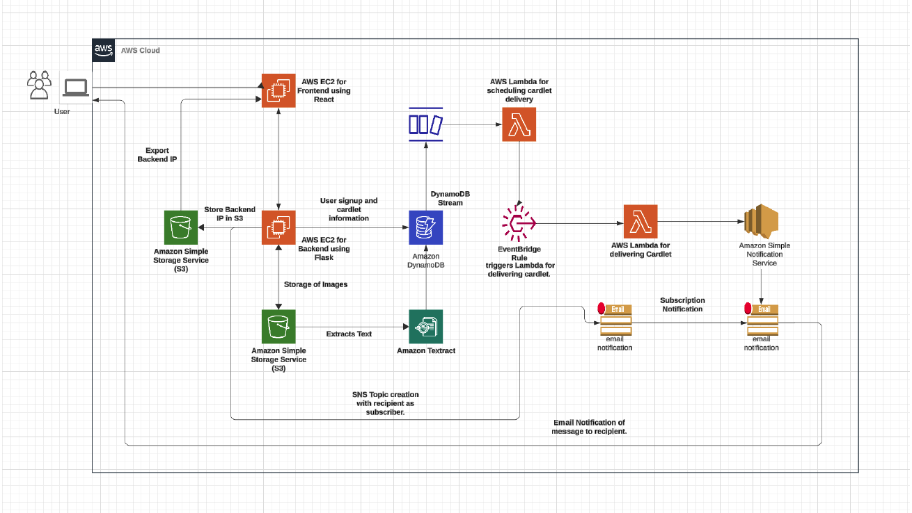

# 💌 Greetly — Scheduled Greeting Card Service

A cloud-native web app for scheduling personalized greeting cards (cardlets) to be delivered automatically on important dates — birthdays, anniversaries, and other milestones.

Built on AWS using a serverless, event-driven architecture.

---

## What it does

Users sign up, write a personalized message, optionally attach an image, pick a recipient, and choose a delivery date. Greetly stores the cardlet and automatically delivers it by email at the scheduled time — no manual intervention needed once it's queued.

---

## Architecture

---

## AWS services used

| Category | Service | Why |
|----------|---------|-----|
| **Compute** | EC2 | Hosts the React frontend and Flask backend |
| | Lambda | Handles cardlet delivery and event-driven tasks without managing servers |
| **Storage** | DynamoDB | Stores user profiles and cardlet metadata |
| | S3 | Stores user-uploaded images and backend IP config |
| **Networking** | EventBridge | Schedules and routes delivery events |
| **General** | Textract | OCR on user-uploaded images |
| | SNS | Sends email notifications to recipients |

---

## Tech stack

- **Frontend:** React, CSS
- **Backend:** Python with Flask
- **Database:** DynamoDB
- **Containerization:** Docker (images hosted on Docker Hub)
- **Infrastructure as Code:** AWS CloudFormation
- **Auto Scaling:** EC2 Auto Scaling

---

## Course

**CSCI 5409 — Advanced Topics in Cloud Computing**
Dalhousie University
